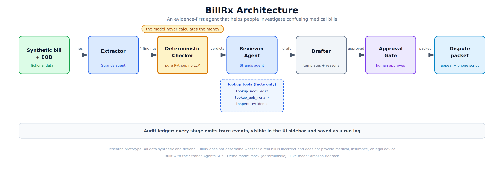

# BillRx

**An evidence-first agent that helps people investigate confusing medical bills.**

BillRx takes an itemized hospital bill and the insurer's explanation of benefits (EOB),
audits every line, and surfaces charges worth questioning, each with exact evidence
citations and a specific question to ask the billing office. It drafts an appeal letter
and a phone script, then waits for human approval before anything is finalized.

Thesis: **the model never calculates the money.** All arithmetic runs in deterministic
code. The agents handle evidence and language.

## Architecture



The pipeline in words: synthetic bill and EOB go to the Extractor; the
deterministic Checker (pure Python, no LLM) produces candidate findings;
the Reviewer agent challenges each one using three lookup tools that return
facts only; the Drafter writes an appeal draft and phone script; the Approval
Gate pauses for a human before anything is finalized.

Every stage emits trace events to an audit ledger, visible in the UI sidebar and
available to judges as a run log.

## The synthetic demo scenario

All data is fictional. The demo is built around exactly four candidate findings:

| # | Finding | Planted truth | Reviewer |
|---|---------|---------------|----------|
| 1 | Duplicate 80053 lab charge, same date | Real issue | KEEP |
| 2 | 80048 billed with 80053 (NCCI component) | Real issue | KEEP |
| 3 | Statement demands $2,484 vs EOB $642 owed | Real issue | KEEP |
| 4 | 36415 venipuncture with ER visit | Clean line | REJECT |

Finding 4 is the honest negative: the Reviewer calls `lookup_ncci_edit`, finds no
edit, and rejects for insufficient evidence. Claim delta: **$1,842.00 difference
worth investigating** (fictional example).

## Run it

```bash
python3 -m venv .venv && .venv/bin/pip install -e ".[dev]"
cp .env.example .env   # MODEL_PROVIDER=mock works with no AWS at all
.venv/bin/python -m pytest
.venv/bin/streamlit run app.py
```

Two modes, one contract:

- **mock** (default): the Reviewer is a deterministic scripted agent. Every run
  produces the exact four-candidate demo contract below. This is the mode used
  for the recorded demo because it is fully reproducible.
- **bedrock**: the Reviewer is a real Strands agent calling a Bedrock model
  (verified with `amazon.nova-lite-v1:0` in us-east-1). Set
  `MODEL_PROVIDER=bedrock`, `MODEL_ID`, and AWS credentials, or run
  `python run_live.py` for a headless check. The live agent genuinely calls the
  lookup tools and returns structured verdicts; a small model may be more
  conservative in its verdicts than the deterministic reference, which is why
  the mock mode is the demo baseline. If the live Reviewer fails to call tools,
  the pipeline automatically falls back to the deterministic scripted review.

## What is synthetic, what is real

- Synthetic: the bill, the EOB, the patient, the provider, the payer, all dollar
  amounts, the NCCI/CARC reference tables (demo scope only).
- Real: the pipeline architecture, the deterministic checker, the Strands agent
  wiring, the tool-calling behavior, the trace ledger.

## Disclaimer

Research prototype for the AWS Agents for Humans hackathon. BillRx does not
determine whether a real medical bill is incorrect and does not provide medical,
insurance, or legal advice.

## License

MIT (see LICENSE).
